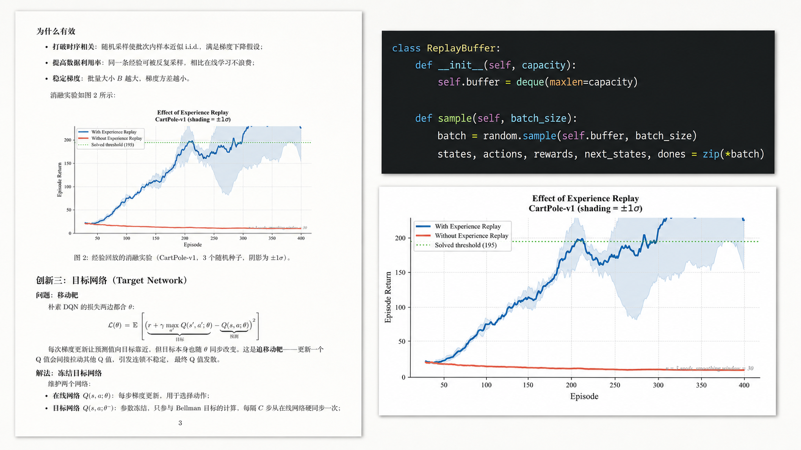

# TESAURO

<p align="center">
  
</p>

<p align="center">
  <strong>Reinforcement Learning Fundamentals</strong><br>
  从价值估计到连续控制，把强化学习讲成可推导、可运行、可复现的系统。
</p>

<p align="center">
  
</p>

TESAURO 是一套面向中文读者的强化学习教学材料。每一章围绕一个明确问题展开：先建立直觉，再给出必要公式，最后用可运行的 notebook 观察结论如何在实验中成立或失效。

当前发布的是 **Fundamentals**：一条从多臂老虎机、MDP 和 TD learning 出发，通向 DQN、PPO 与 SAC 的经典深度 model-free RL 主线。

TESAURO 是独立教育项目，与 Gerald Tesauro 或 IBM 没有隶属、合作或背书关系。

## 如何使用

1. 按下方顺序阅读 PDF，先建立整体的决策与价值学习框架。
2. 在涉及算法的章节中对照 TeX，追踪目标函数、估计量和稳定化机制。
3. 运行 notebook，改变随机种子、超参数或算法组件，亲自观察训练曲线与失败模式。

建议具备 Python、基础概率论以及 PyTorch 入门知识。阅读本项目不要求预先掌握强化学习。

## 内容

| # | 章节 | 核心问题 | 材料 |
|---|---|---|---|
| 1 | [多臂老虎机](notes/fundamentals/multi-armed-bandit/multi-armed-bandit.pdf) | 探索与利用如何权衡？ | PDF |
| 2 | [马尔可夫决策过程](notes/fundamentals/mdp/mdp.pdf) | 如何形式化一个序列决策问题？ | PDF |
| 3 | [时序差分学习](notes/fundamentals/temporal-difference-learning/temporal-difference-learning.pdf) | 如何从一步反馈中估计长期价值？ | PDF |
| 4 | [n-step TD](notes/fundamentals/n-step-td/nstep.pdf) | 如何在偏差与方差间选择回报长度？ | [PDF](notes/fundamentals/n-step-td/nstep.pdf) · [TeX](notes/fundamentals/n-step-td/nstep.tex) · [Notebook](notes/fundamentals/n-step-td/nstep_experiments.ipynb) |
| 5 | [DQN](notes/fundamentals/dqn/dqn.pdf) | 神经网络如何稳定地学习价值函数？ | [PDF](notes/fundamentals/dqn/dqn.pdf) · [TeX](notes/fundamentals/dqn/dqn.tex) · [Notebook](notes/fundamentals/dqn/dqn_experiments.ipynb) |
| 6 | [Policy Gradient / REINFORCE](notes/fundamentals/policy-gradient/pg.pdf) | 为什么直接优化策略？ | [PDF](notes/fundamentals/policy-gradient/pg.pdf) · [TeX](notes/fundamentals/policy-gradient/pg.tex) · [Notebook](notes/fundamentals/policy-gradient/pg_experiments.ipynb) |
| 7 | [Actor-Critic / A2C](notes/fundamentals/actor-critic/ac.pdf) | 价值估计如何帮助策略更新？ | [PDF](notes/fundamentals/actor-critic/ac.pdf) · [TeX](notes/fundamentals/actor-critic/ac.tex) · [Notebook](notes/fundamentals/actor-critic/ac_experiments.ipynb) |
| 8 | [PPO](notes/fundamentals/ppo/ppo.pdf) | 如何约束策略更新的幅度？ | [PDF](notes/fundamentals/ppo/ppo.pdf) · [TeX](notes/fundamentals/ppo/ppo.tex) · [Notebook](notes/fundamentals/ppo/ppo_experiments.ipynb) |
| 9 | [SAC](notes/fundamentals/sac/sac.pdf) | 连续控制中如何兼顾探索与利用？ | [PDF](notes/fundamentals/sac/sac.pdf) · [TeX](notes/fundamentals/sac/sac.tex) · [Notebook](notes/fundamentals/sac/sac_experiments.ipynb) |
| - | [主线串讲](notes/fundamentals/mainline-summary/mainline-summary.pdf) | 各章如何构成一条完整的方法主线？ | [PDF](notes/fundamentals/mainline-summary/mainline-summary.pdf) · [TeX](notes/fundamentals/mainline-summary/mainline-summary.tex) |

前三章目前提供 PDF；其余算法章节同时提供 TeX 源码与 notebook。

## 材料的组织方式

- **笔记**：解释一个方法要解决什么问题，以及它为什么这样设计。
- **推导**：保留目标函数、关键近似和实现假设，便于回查细节。
- **实验**：以受控 toy 环境检验单个机制的作用，不将局部现象包装成通用性能结论。

## 运行 Notebook

实验使用 Python、PyTorch 与 Gymnasium。创建虚拟环境后安装依赖：

```bash
python -m venv .venv
pip install -r requirements.txt
jupyter lab
```

打开对应章节目录中的 `*_experiments.ipynb` 即可运行。实验默认使用 CPU；若系统可用，PyTorch 会自动使用 CUDA。

## 当前范围

本版本聚焦经典深度 model-free RL，覆盖价值学习、策略梯度、Actor-Critic、稳定策略优化与最大熵连续控制。模型式强化学习、多智能体强化学习及其他主题不包含在本次发布中。

## 许可

文字、PDF、TeX 与视觉材料采用 [CC BY 4.0](LICENSE)；Jupyter notebook 中的代码采用 [MIT 许可](LICENSE-CODE)。引用方式见 [CITATION.cff](CITATION.cff)。
